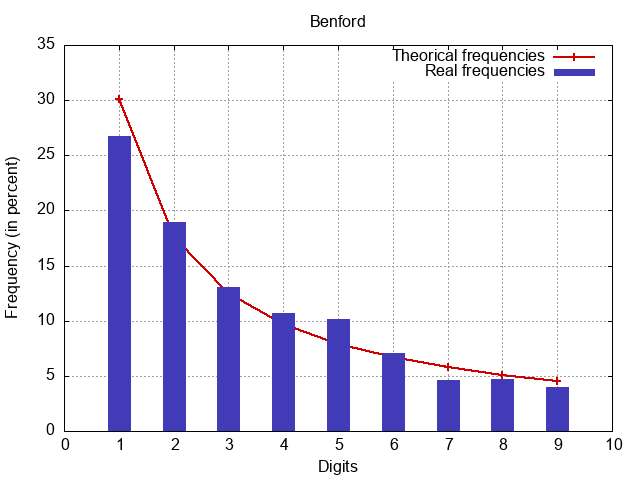

# Benford's law

This little program was created as part of my studies. It compared the first digit a set of statistical data, for exemple the world population in 2021, with Benford's law.

> Benford's law, also known as the Newcomb–Benford law, the law of anomalous numbers, or the first-digit law, is an observation that in many real-life sets of numerical data, the leading digit is likely to be small.[1] In sets that obey the law, the number 1 appears as the leading significant digit about 30% of the time, while 9 appears as the leading significant digit less than 5% of the time. [Wikipedia](https://en.wikipedia.org/wiki/Benford%27s_law), The Free Encyclopedia. "Benford's law."

## Installation

To use this program on your computer, make sure you have [GNUplot](https://sourceforge.net/projects/gnuplot/) installed (and of course C with a compiler)

Then use : `git clone https://github.com/Mackevv/benford.git` to install this program on your computer.

## Usage

Compile all files with a compiler (e.g GCC) with the command :
```
gcc *.c -o benford
```
Run the program with your data :
```
benford.exe data.csv
```

This program only accepts CSV files that must contain numbers only. The numbers can be separated by a comma (","), semicolon (";"), space (" "), or line break. To format your data and retain only the necessary numbers, you can use an extension like [Rainbow CSV](https://marketplace.visualstudio.com/items?itemName=mechatroner.rainbow-csv).

### Exemple using COVID-19 cases records in France from 2020 to 2023

```
benford.exe ./data/covid19-cases-france.csv
```

The program generates a chart where theoretical frequencies represent the frequencies of the first digit predicted by Benford's Law, and real frequencies represent the frequencies of the first digit of the numbers in the `covid19-cases-france.csv` file.

<div style="display: flex; justify-content: center; margin-top:50px;">
  
</div>